# 💸 Gestor Financeiro Pessoal em AutoHotkey v2

Um aplicativo de controle financeiro pessoal, simples e funcional, criado com AutoHotkey v2. Permite registrar receitas e despesas, visualizar lançamentos e acompanhar o saldo atualizado em tempo real — tudo salvo automaticamente em um arquivo `.csv`.

## 🚀 Funcionalidades

- Registrar **receitas** e **despesas** com descrição, valor e categoria
- Interface gráfica amigável com abas organizadas
- Visualização dos **10 lançamentos mais recentes**
- Cálculo automático de **total de receitas, despesas e saldo**
- Opção para **abrir o CSV** diretamente
- Possibilidade de **excluir lançamentos** diretamente da interface

## 🛠️ Tecnologias

- [AutoHotkey v2](https://www.autohotkey.com/)
- Interface gráfica com `Gui()`
- Persistência de dados via arquivo `.csv`

   ## 📦 Instalação

1. Instale o [AutoHotkey v2](https://www.autohotkey.com/download/)
2. Clone este repositório:
   - copie a estrutura do códico que se encontra na pasta script, abra executavel GestorFinanceiro.ahk pelo note pad e cole.

3. - Execute o script:

   Dê dois cliques em GestorFinanceiro.ahk, ou

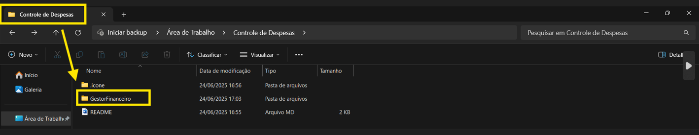
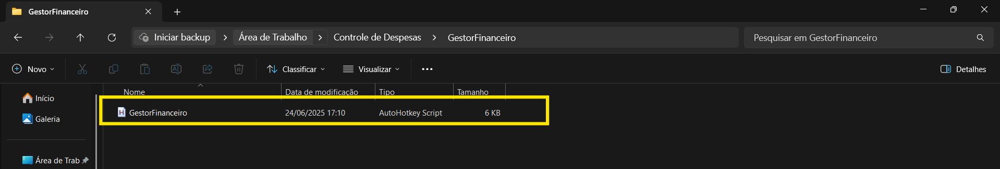

## 🖥️ Capturas de Tela

-  **FUNCIONALIDADES**

**Despesas:**

Nesta tela podemos estar realizando o lançamento de despesas diárias, para realizar a rotina é necessario informar nos campos e salvar.

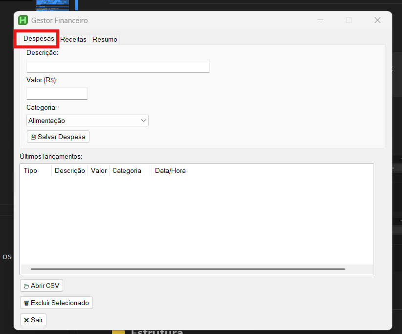

- Descrição
- Valor
- Categoria

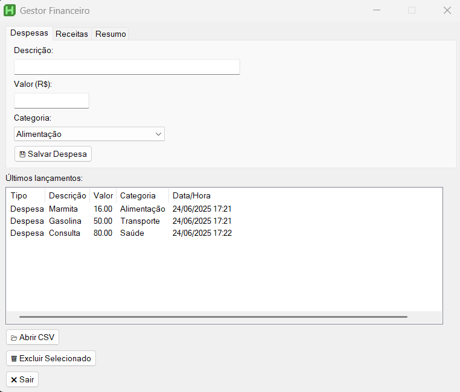

Após preencher os campos e salvar as informações ele grava em uma tela de visualização, esta tela ela informa os 10 ultimos lançamentos, trazendo uma melhor dinamica na hora do lançamento.

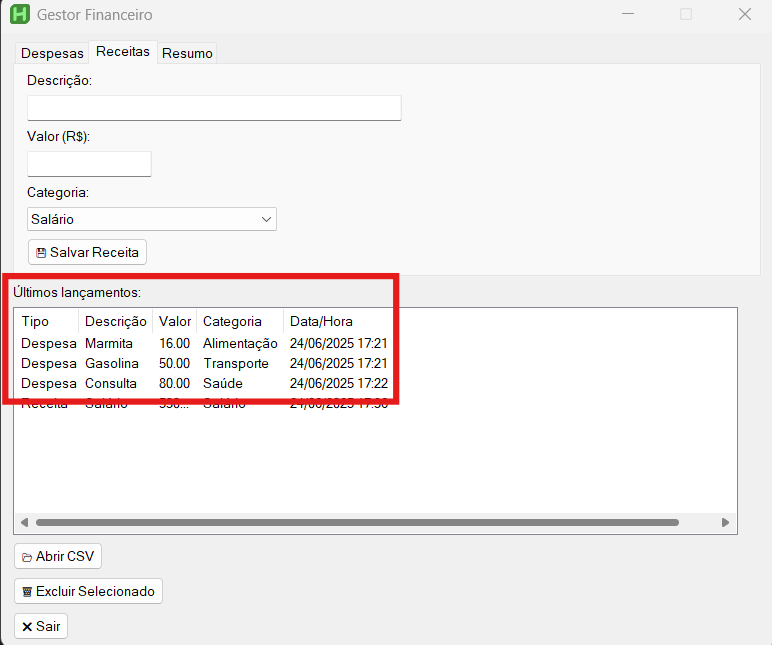

---
**Abrir CSV**

Este botão ele tem a funcionalidade de abrir os lançamentos ja em excel, trazendo uma rapidez ao processo caso seja necessario realizar relatórios ou tabelas dinamica.

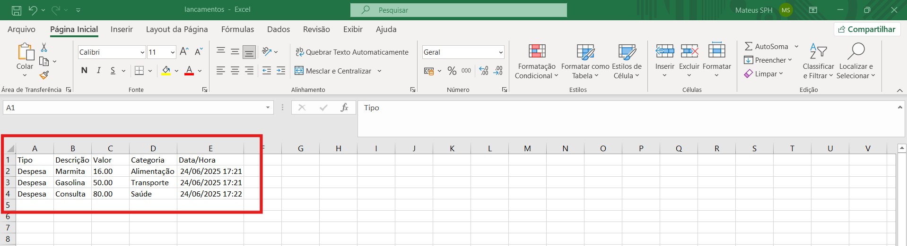

**Receitas:**

Nesta tela podemos estar realizando o lançamento de despesas diárias, para realizar a rotina é necessario informar nos campos e salvar.

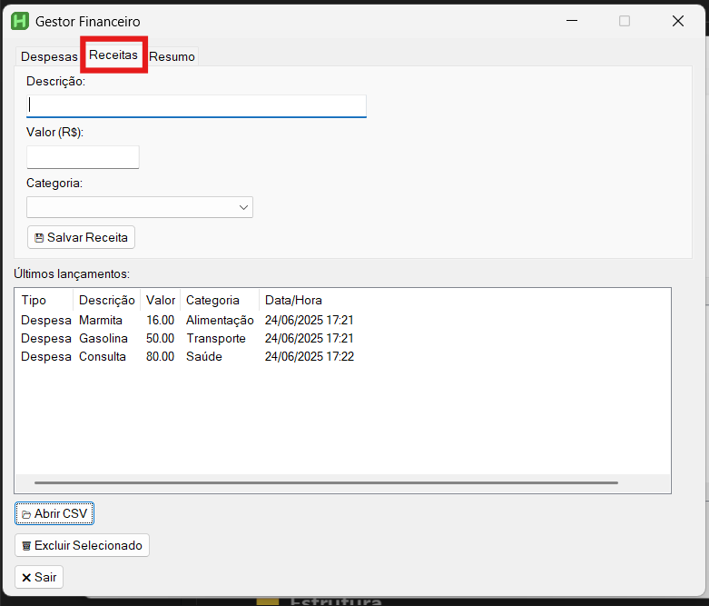

- Descrição
- Valor
- Categoria

Após preencher os campos e salvar as informações ele grava em uma tela de visualização, esta tela ela informa os 10 ultimos lançamentos, trazendo uma melhor dinamica na hora do lançamento.

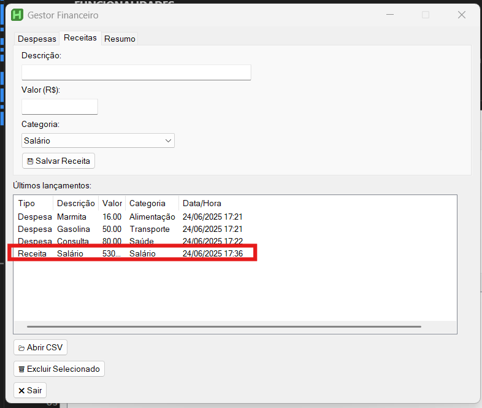

---
**Abrir CSV**

Este botão ele tem a funcionalidade de abrir os lançamentos ja em excel, trazendo uma rapidez ao processo caso seja necessario realizar relatórios ou tabelas dinamica.

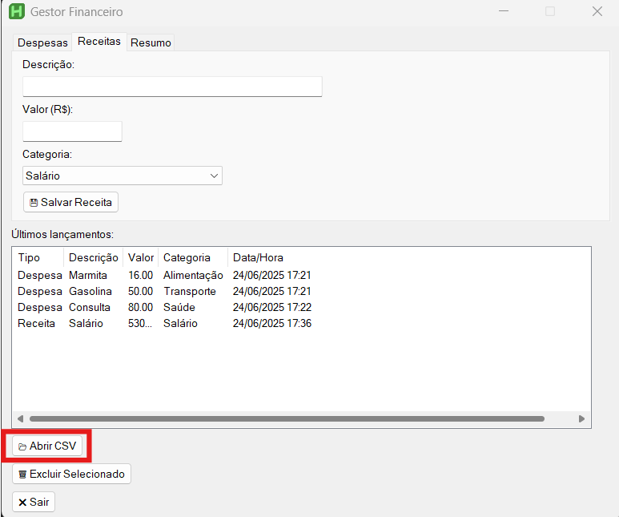
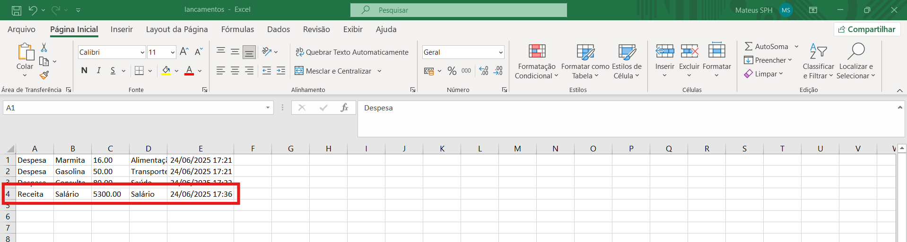

**Resumo:**
Nesta tela temos a seguinte funcionalidade, a soma de todas as Despesas e Receitas, e tambem tras um Saldo atual, que seria a subtração entre Despesas e Receitas.

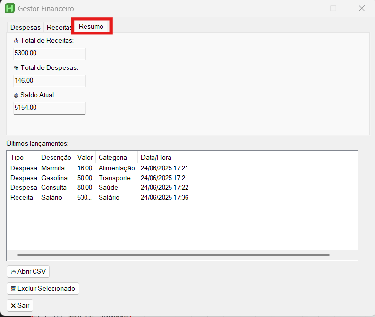
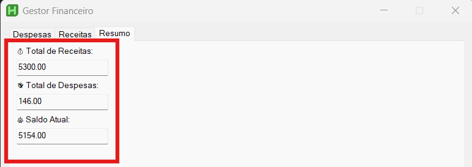

## 📁 Estrutura
- GestorFinanceiro.ahk – código-fonte principal
- lancamentos.csv – gerado automaticamente para armazenar os dados

## 📈 Possíveis melhorias futuras:

- Filtros por período e categoria
- Exportação em PDF ou Excel
- Gráficos e estatísticas visuais com GDI+
- Backup automático
- Alerta de 80% de gastos
- Icone para a area de trabalho

